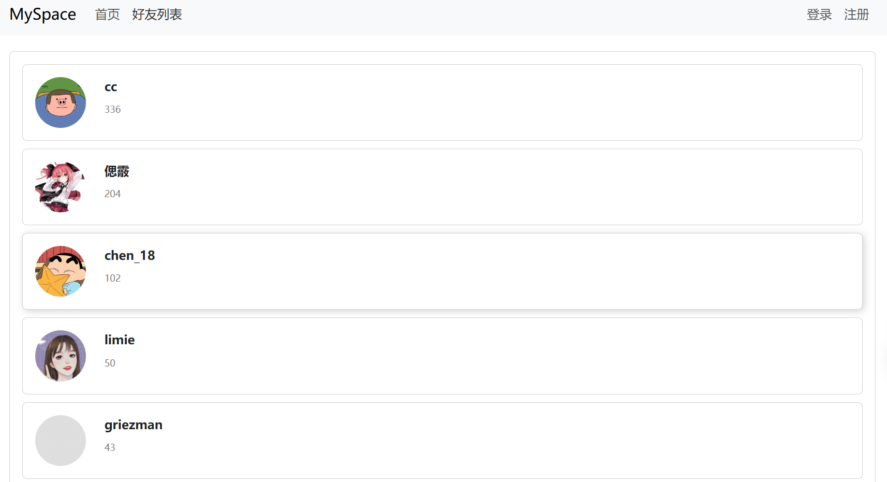
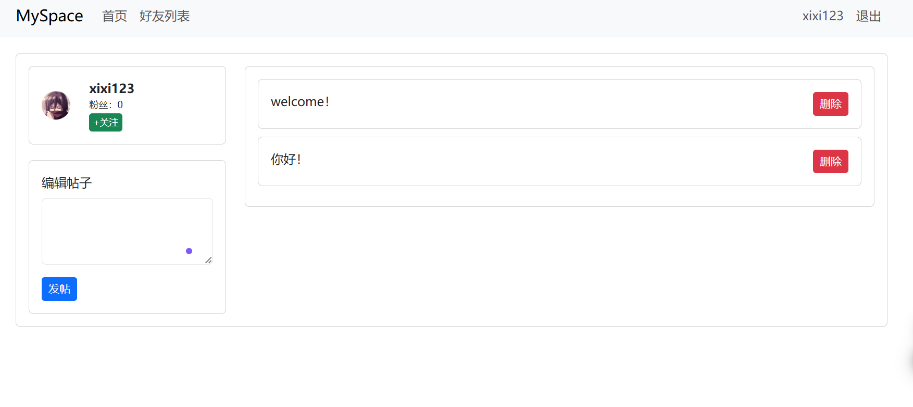

# 个人博客

## 项目运行

```bash
npm install
npm run serve
```

运行后项目在`http://localhost:8080/`打开

## 项目介绍

开发了一款基于 Vue3 的个人博客系统，支持用户注册、登录、发帖、关注好友等功能。通过 Vuex 管理全局状态，使用 Vue Router 实现页面导航，并集成 Bootstrap 提供响应式布局。

## 项目截图

### 好友列表页面



### 个人主页页面


